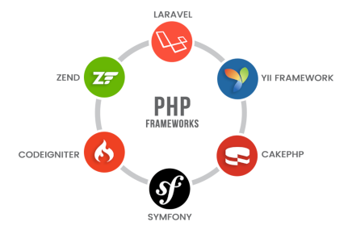

---?image=assets/img/cms-frame.png&size=auto 90%&color=black
@title[Introdução]

#### @size[0.6em](A batalha dos @color[#e49436](CMS)/Frameworks)

 

---?color=#333

@title[Qual a diferença?]

@snap[north-east]
<h4>Qual a @color[#e49436](diferença?)</h4>
@snapend

@snap[west]

@snapend

@snap[east]

@snapend

@snap[midpoint]

@snapend

---?color=#333
@title[Framework]
@snap[north]
<h4>Framework</h4>
@snapend

@snap[west]

@ul
- Possui um conjunto de bibliotetas
- Grande flexibilidade
- Não possui administração
- Seguem padrões de programação primarias
- Podem compor um @color[#e49436](CMS)
@ulend

@snapend

@snap[east]

@snapend

---
@title[CMS]
@snap[north]
<h4>CMS</h4>
@snapend

@snap[west]

@ul
- Possui administração
- Pode conter um ou mais @color[#e49436](Frameworks)
- Não possui administração
- São menos flexiveis
- Exigem um grau de conhecimento além da programação
- Possuem regras e padrões próprios
@ulend

@snapend

@snap[east]

@snapend